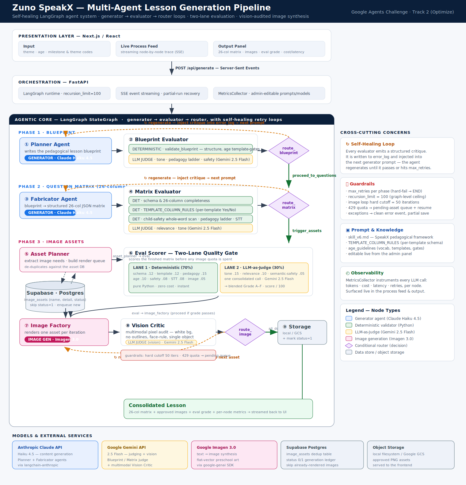
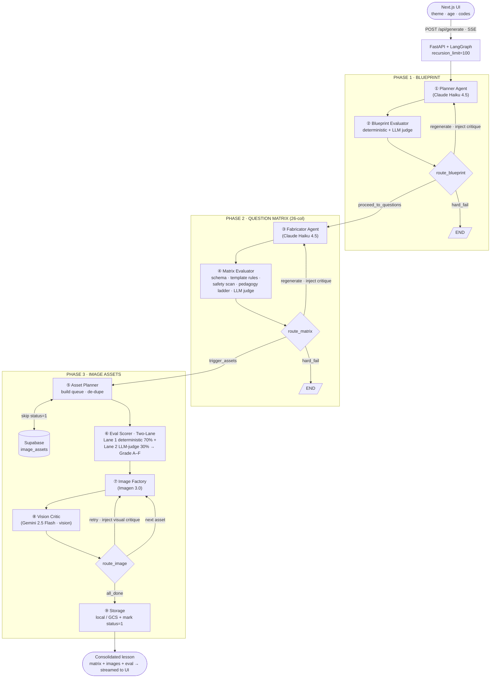

# Zuno SpeakX — Multi-Agent Lesson Generation Pipeline

> An autonomous, **self-healing agent system** that turns a single prompt (*theme + age*)
> into a complete, illustrated, pedagogically-validated speaking lesson for children
> ages 3–8 — built on **LangGraph**, with a generator → evaluator → router loop at
> every phase, a two-lane evaluation gate, and a vision-audited image pipeline.

*(If the SVG does not render, see [`architecture.png`](./architecture.png).)*

---

## 1. Agentic design at a glance

The system is a **LangGraph `StateGraph`** composed of nine nodes across three phases.
Every phase follows the same **generator → evaluator → router** pattern, and every
evaluator can send the agent back to *regenerate* with an injected critique — the
**self-healing loop** that lets cheap models produce production-grade output.

| # | Node | Role | Type | Model |
|---|------|------|------|-------|
| ① | **Planner** | Writes the lesson blueprint | Generator | Claude Haiku 4.5 |
| ② | **Blueprint Evaluator** | Structure + pedagogy + safety gate | Deterministic + LLM Judge | Gemini 2.5 Flash |
| ③ | **Fabricator** | Blueprint → 26-column question matrix | Generator | Claude Haiku 4.5 |
| ④ | **Matrix Evaluator** | Schema, template rules, safety, ladder | Deterministic + LLM Judge | Gemini 2.5 Flash |
| ⑤ | **Asset Planner** | Build image queue, de-duplicate | Tool node | — (Supabase) |
| ⑥ | **Eval Scorer** | Two-lane quality gate before image spend | Deterministic + LLM Judge | Gemini 2.5 Flash |
| ⑦ | **Image Factory** | Render one asset per iteration | Image generator | Imagen 3.0 |
| ⑧ | **Vision Critic** | Multimodal pixel audit | LLM Judge (vision) | Gemini 2.5 Flash |
| ⑨ | **Storage** | Persist approved PNGs, mark generated | Tool node | local / GCS + Supabase |

---

## 2. The flow (portable Mermaid)

---

## 3. Agentic patterns that make it robust

### a. Self-healing generator–evaluator loops
Each generator (Planner, Fabricator, Image Factory) is paired with an evaluator.
On failure the evaluator writes a **structured critique** into `error_log`, which is
**injected into the next generation prompt**. The agent retries with full knowledge of
what went wrong — until it passes or hits `max_retries`, at which point the phase
hard-fails to `END`. This is what lets a fast, low-cost model (Claude Haiku 4.5)
reliably hit a strict pedagogical spec.

### b. Hybrid evaluation — deterministic + LLM-as-Judge
Evaluators run **cheap deterministic checks first** (zero cost, instant: schema,
26-column completeness, per-template `TEMPLATE_COLUMN_RULES`, whole-word child-safety
scan, pedagogy-ladder ordering, STT hygiene, image-filename format), and only then
spend an LLM-judge call for the **context-sensitive** dimensions (tone, relevance,
semantic safety). Safety is enforced on the **child-facing matrix**, not on the model's
internal reasoning.

### c. Two-lane scoring gate before spending image quota
The **Eval Scorer** grades the finished matrix on a weighted rubric —
**Lane 1 (deterministic, 70%)** + **Lane 2 (LLM-as-Judge, 30%)** → blended **Grade A–F /
score-100** — *before* any image is generated, so quota is never wasted on weak content.

### d. Idempotent image generation with a dedup ledger
The **Asset Planner** checks **Supabase Postgres** (`image_assets`, `status 0/1`) and
**skips any image already generated**, queuing only new ones. On success the Vision
Critic marks `status=1`. Re-runs cost nothing for existing art.

### e. Guardrails against runaway cost
`max_retries` per phase · graph-level `recursion_limit=100` · image-loop **hard cutoff
(50 iterations)** · `429` quota → assets parked on a **pending queue** and resumed ·
any unhandled exception becomes a **clean error event with a partial-run save** rather
than a crashed stream.

### f. Full observability
A `MetricsCollector` instruments **every** LLM/image call — tokens, cost, latency,
retries — per node, surfaced live in the streaming process feed and the output panel.

---

## 4. Models & services

| Provider | Model | Used for |
|----------|-------|----------|
| **Anthropic Claude API** | Haiku 4.5 | Content generation (Planner, Fabricator) |
| **Google Gemini API** | 2.5 Flash | LLM-as-Judge + multimodal Vision Critic |
| **Google Imagen** | 3.0 | Flat-vector preschool image synthesis |
| **Supabase** | Postgres | `image_assets` dedup / generation ledger |
| **Storage** | local FS / Google GCS | Approved PNG assets served to the UI |

---

## 5. Why this fits *Track 2 — Optimize*

The pipeline is an **optimization loop end-to-end**: deterministic gates short-circuit
expensive LLM calls; a quality score gates image spend; a dedup ledger eliminates
repeat generation; self-healing turns retries into improvements instead of wasted
tokens; and every call is cost-instrumented so the optimization is measurable.
